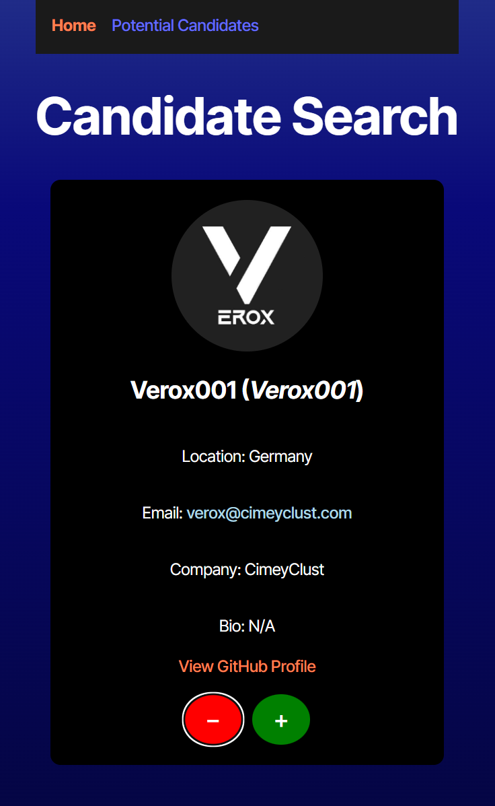
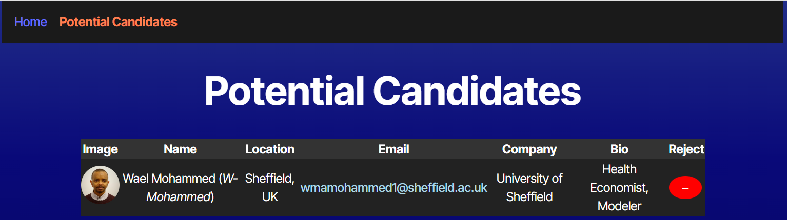

# Kyle's Candidate Search Application

## Description 
📝 
This is a candidate search application that will be deployed to Render. This search application will use the API to pull GitHub users and prompt the app user to accept or reject the user for consideration.

## App Link
📽️- [Demo Link of Candidate Search application](https://candidate-search-kyle-style.onrender.com/)  
## 🎨 **Mock-Up**

## Table of Contents 📋 
- [Installation](#installation)
- [Usage](#usage)
- [License](#license)
- [Contributing](#contributing)
- [Tests](#tests)
- [Questions](#questions)

## Installation
💽 
First, Download the required dependencies, react, react-dom, and react-router-dom. Once the dependencies are installed on the package.json, then you will need to run the terminal commands.  
As follows the terminal commands are npm install, npm run build, and lastly npm run dev. This is for local execution. It is already remotely deployed at the Render links above and below. 

## Usage
🖱️ 
You may use the deployed Render link to use this application (https://candidate-search-kyle-style.onrender.com/).

## License
This project is licensed under the [MIT License](https://opensource.org/licenses/MIT).

## Contributing
✍️ 
Any developers can contribute under the MIT license. 

## Tests
🖥️ 
You may test the code by executing the integrated terminal command, "npm run dev" or by launching the Render link. From there, either reject or accept the populated GitHub user. Navigation to the Potential Candidates page and reject any users saved to narrow your candidate pool. 

## Questions
❓ 
For additional questions, reach out to me via:
- GitHub: [KyBrMar12](https://github.com/KyBrMar12)
- Email: KyBrMar@gmail.com
